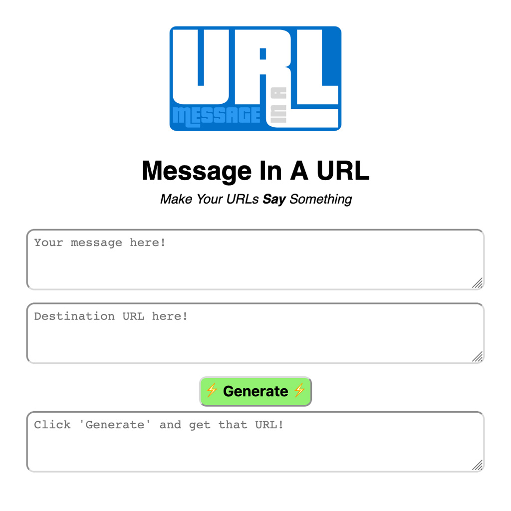

  

# Message In A URL

`Message in a URL` allows users to encode text within a URL.

More specifically, this repository contains a website that allows users to input a message and a destination URL, and get back a URL with the message encoded in it that redirects to the destination URL. For example: [https://stuffjackmakes.com/miau/?Check_out_this_🔥_🦆_search_engine!_aHR0cHM6Ly9kdWNrZHVja2dvLmNvbS8=](https://stuffjackmakes.com/miau/?Check_out_this_🔥_🦆_search_engine!_aHR0cHM6Ly9kdWNrZHVja2dvLmNvbS8=) links to [https://duckduckgo.com/](https://duckduckgo.com/)

  

## How it Works

The `index.html` file includes code to read additional arguments to the `window.location`. When it detects an encoded URL, it immediately decodes it and redirects the user there before finishing loading the page.

## Encoding

The URLs are encoded as follows:

* The base URL (e.g. `http://example.com/index.html`)
* A `?` character to mark the start of an encoded URL
* The plaintext message (e.g. `Your_URL_message_here!`)
* A `_` character to mark the end of the message
* The [base64](https://en.wikipedia.org/wiki/Base64) encoded destination URL

## Limitations

* It is possible to generate invalid encoded URLs
* It is possible to redirect to invalid destination URLs

## Setup

Host the `index.html` file with your software of choice and you're done!

## Author

Check out my other work at [stuffjackmakes.com](https://stuffjackmakes.com)